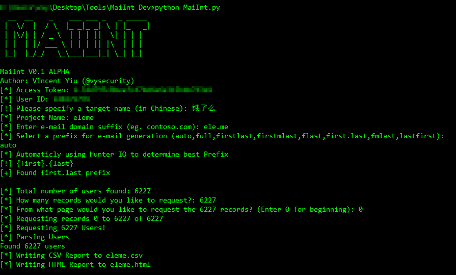
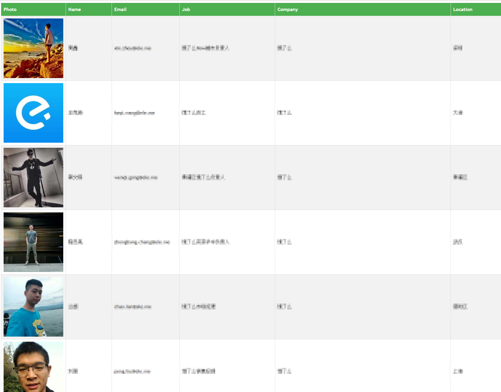
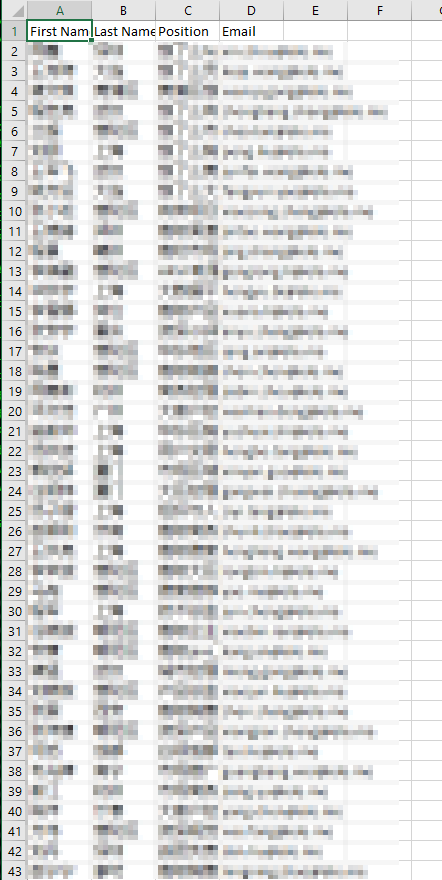

# Credits

Author: @vysecurity

# Change Log

[v0.1 ALPHA 01-01-2018]
Additions:
* Initial Release

# Usage

Note: you can only input Chinese into commandline if you change your locale. Make sure you do this. Tried and tested on Windows.

* Register an account on MaiMai mobile application

* Register an account on Hunter.io

* Obtain Hunter.io API key

* Put in MaiMai credentials in MaiInt.py

* Put Hunter.io API key in MaiInt.py

* Run MaiInt.py and follow instructions, if you don't know how to run it, follow the blog post and video.

# Example

Two output formats are generated, previews below:

